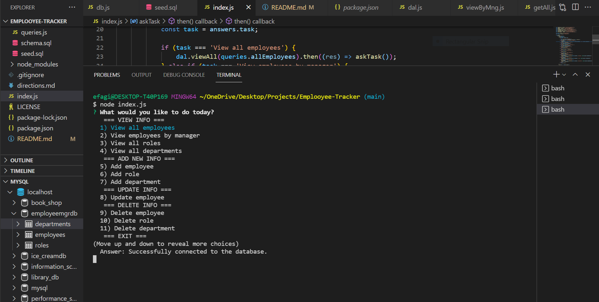

# 12 Emplooyee-Tracker

## Assignemnt

For the twelfth homework assignment in week twelve of UNH Full-Stack Coding Bootcamp I was to build a commmand line application to track employees in a company. 


## Description
```
The Employee Tracker app allows for a company to manage its employees, roles, and departments.

Features of the app

* Create a department, role, and employee
* View all departments, roles, and employees
* Delete a departmet, role, and employee
* Assign managers to employees
* Switch employee roles and managers 

```

## Built with
```
* Javascript
* Node.js
* MySql
```


## Installation
```

You will need to clone the respositry from Github to your local machine then open up your preferred terminal and navigate to the directory where you cloned the github repository.

You will need ro run in the terminal:

npm install

npm start

To execute the Sql files open MySql Workbech paste the schema.sql and seed.sql in there and execute

```


## Dependancis
```
* Inquirer 
* mysql
* console.table
```

## Credits

UNH Full Stack Coding Book Camp partnered with Trilogy Education Services

Course Instructor - Benjamin Hutchins

Course TA - Andrew Hatfield

Tutor - Morgan Splawn

Study Group - Patrick Sullivan [Github](https://github.com/shabobble) Alan Balcom [Github](https://github.com/abalcs) Swetha Reddivari [Github](https://github.com/swethareddyl)


## Deployment Links

[GitHub Repository](https://github.com/efagioli01/Emplooyee-Tracker)


## VIDEO OF DEPLOYED APPLICATION

<!-- Vide of working application [https://youtu.be/aGdqeQkf6lU]  -->

[](http://www.youtube.com/watch?v=aGdqeQkf6lU)

--CLICK ON THE IMAGE TO VIEW THE VIDEO--


 ## MIT License


Permission is hereby granted, free of charge, to any person obtaining a copy
of this software and associated documentation files (the "Software"), to deal
in the Software without restriction, including without limitation the rights
to use, copy, modify, merge, publish, distribute, sublicense, and/or sell
copies of the Software, and to permit persons to whom the Software is
furnished to do so, subject to the following conditions:

The above copyright notice and this permission notice shall be included in all
copies or substantial portions of the Software.

THE SOFTWARE IS PROVIDED "AS IS", WITHOUT WARRANTY OF ANY KIND, EXPRESS OR
IMPLIED, INCLUDING BUT NOT LIMITED TO THE WARRANTIES OF MERCHANTABILITY,
FITNESS FOR A PARTICULAR PURPOSE AND NONINFRINGEMENT. IN NO EVENT SHALL THE
AUTHORS OR COPYRIGHT HOLDERS BE LIABLE FOR ANY CLAIM, DAMAGES OR OTHER
LIABILITY, WHETHER IN AN ACTION OF CONTRACT, TORT OR OTHERWISE, ARISING FROM,
OUT OF OR IN CONNECTION WITH THE SOFTWARE OR THE USE OR OTHER DEALINGS IN THE
SOFTWARE.


Copyright (c) 2021 Erica F


